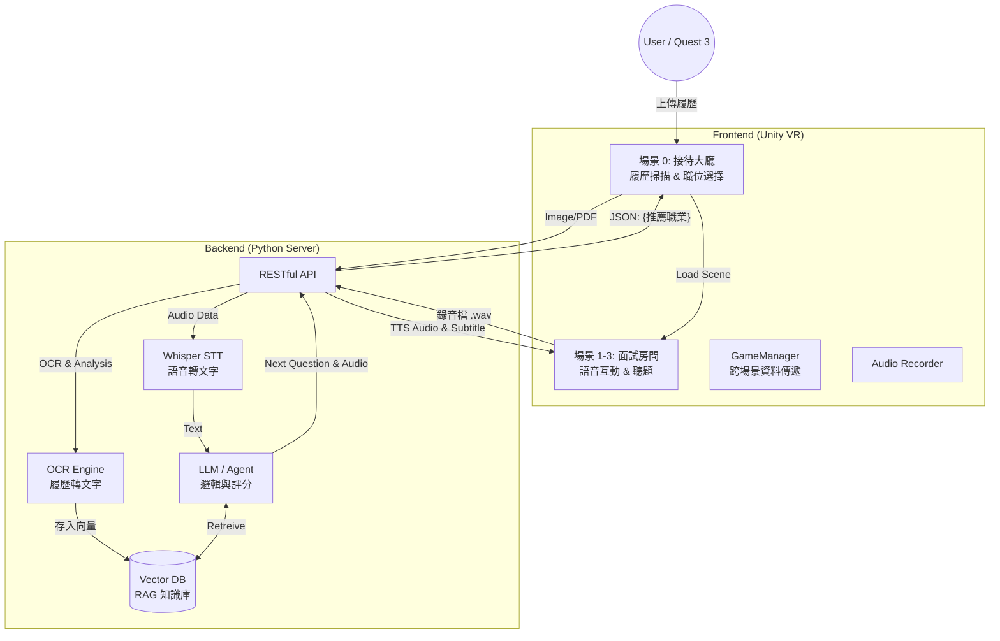

# VR RAG Interview Bot (沉浸式 AI 面試模擬系統)

> 結合 **VR 虛擬實境**、**RAG (檢索增強生成)** 與 **OCR 文字辨識** 技術，為求職者提供高度客製化、沉浸式的面試演練體驗。

## 📖 專案簡介 (Introduction)

本專案旨在解決傳統面試練習缺乏臨場感與客製化回饋的問題。透過 Unity 建構 VR 場景，結合後端強大的 LLM (大型語言模型) 運算能力，系統能根據使用者上傳的「真實履歷」，自動生成對應職缺（前端、後端、PM 等）的面試題目。

系統採用 **Client-Server 架構**，前端專注於沉浸式體驗與互動，後端負責繁重的 AI 運算（語音轉文字 STT、語意分析、題目生成），以確保 Meta Quest 3 裝置能維持流暢的效能表現。

## 🌟 核心功能 (Key Features)

* **履歷分析 (Resume Analysis):**
    * 在 VR 中支援掃描/拍攝履歷。
    * 後端透過 OCR 辨識內容，並利用 LLM 自動推薦適合的面試職位。
* **RAG 動態問答 (Dynamic Questioning):**
    * 不同於傳統固定的題庫，系統將使用者的「履歷內容」與「職缺要求」存入向量資料庫 (Vector DB)。
    * 面試官 (AI) 會針對使用者的經歷進行追問（例如：「我看您履歷提到 Vue.js，請說明其生命週期...」）。
* **全語音互動 (Voice Interaction):**
    * **STT (Speech-to-Text):** 前端錄製音檔傳送至後端，透過 Whisper 等模型進行高精準度辨識（優化專有名詞與中英夾雜的辨識率）。
    * **TTS (Text-to-Speech):** AI 面試官具備語音合成能力，提供真實對話感。
* **沉浸式場景切換:** 根據選擇的職業（前端/後端/PM），動態切換至對應的面試房間與 3D 角色。

## 🏗️ 系統架構 (System Architecture)

本專案採用前後端分離設計，確保邏輯清晰與擴充性。

