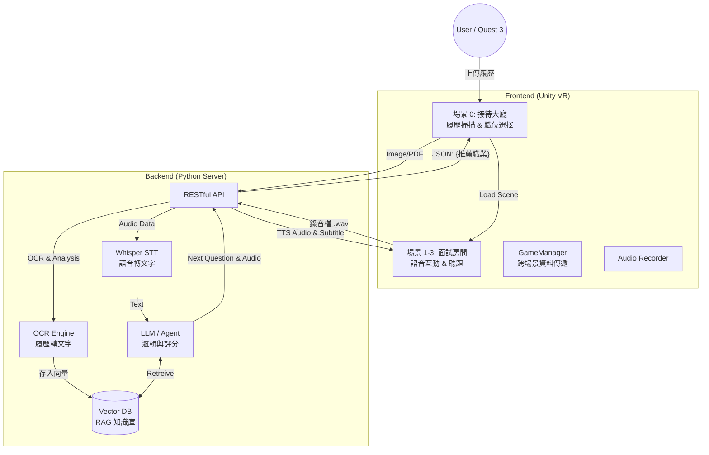

# VR RAG Interview Bot (沉浸式 AI 面試模擬系統)


> 結合 **VR 虛擬實境**、**RAG (檢索增強生成)** 與 **OCR 文字辨識** 技術，為求職者提供高度客製化、沉浸式的面試演練體驗。

## 專案簡介 (Introduction)

本專案旨在解決傳統面試練習缺乏臨場感與客製化回饋的問題。透過 Unity 建構 VR 場景，結合後端強大的 LLM (大型語言模型) 運算能力，系統能根據使用者上傳的「真實履歷」，自動生成對應職缺（前端、後端、PM 等）的面試題目。

系統採用 **Client-Server 架構**，前端專注於沉浸式體驗與互動，後端負責繁重的 AI 運算（語音轉文字 STT、語意分析、題目生成），以確保 Meta Quest 3 裝置能維持流暢的效能表現。

## 核心功能 (Key Features)

* **履歷分析 (Resume Analysis):**
    * 在 VR 中支援掃描/拍攝履歷。
    * 後端透過 OCR 辨識內容，並利用 LLM 自動推薦適合的面試職位。
* **RAG 動態問答 (Dynamic Questioning):**
    * 不同於傳統固定的題庫，系統將使用者的「履歷內容」與「職缺要求」存入向量資料庫 (Vector DB)。
    * 面試官 (AI) 會針對使用者的經歷進行追問（例如：「我看您履歷提到 Vue.js，請說明其生命週期...」）。
* **全語音互動 (Voice Interaction):**
    * **STT (Speech-to-Text):** 前端錄製音檔傳送至後端，透過 Whisper 等模型進行高精準度辨識（優化專有名詞與中英夾雜的辨識率）。
    * **TTS (Text-to-Speech):** AI 面試官具備語音合成能力，提供真實對話感。
* **沉浸式場景切換:** 根據選擇的職業（前端/後端/PM），動態切換至對應的面試房間與 3D 角色。

## 系統架構 (System Architecture)

本專案採用前後端分離設計，確保邏輯清晰與擴充性。



## 快速啟動 (Quick Start)

### 1. 前置準備 (Prerequisites)

* **Ollama 服務：** 本專案需要 Ollama 作為後端 LLM 服務器。請確保您已安裝並運行 Ollama 服務。
* **Meta Quest 3 裝置：** (用於沉浸式體驗)。
* **Python 3.10 環境。**
* **Unity 專案環境：** 安裝與專案版本相符的 Unity Editor。

### 2. 後端環境設定與運行

我們使用 `uv` 進行依賴管理。

1.  **安裝依賴：** 進入專案根目錄，同步所有 Python 依賴：

    ```bash
    cd src
    uv sync
    ```

    > **提示：** 如果缺少任何 Python 模組，請使用 `uv add <module_name>` 安裝。

2.  **配置 LLM 模型：** 確保您已透過 Ollama 下載所需模型，例如 gpt-oss:20b：

    ```bash
    # 在新的終端機中執行
    ollama pull gpt-oss:20b
    ```

3.  **環境變數配置 (`.env`)：**

    在 `src/` 目錄內創建 `.env` 檔案，用於儲存 API Key 或其他配置。

    ```ini
    # .env (範例)
    # AZURE_SUBSCRIPTION_KEY=your_secret_key
    # AZURE_ENDPOINT=your_secret_key
    ```

4.  **運行後端服務：** 進入 `src` 目錄，並啟動服務：

    ```bash
    uv run main.py
    ```

    > **操作提醒：** 當系統提示 `請上傳履歷 (PDF/圖片):` 時，請輸入您的履歷檔案的**完整路徑**。
    >
    > *範例輸入:* `C:\Users\YourName\Documents\resume.pdf`

## 專案結構與文件說明 (Project Structure)

本專案採用模組化設計，以下是各主要檔案及其功能說明：

| 檔案名稱 | 模組類別 | 主要功能描述 |
| :--- | :--- | :--- |
| `main.py` | 執行主控 | 專案的主入口點。負責初始化 RAG 引擎、處理履歷 OCR 輸入、推斷面試職位，並啟動與管理面試問答循環。 |
| `search_engine.py` | 輔助檢索/I/O | 包含使用 **Azure OCR** 讀取履歷（並觸發結構化）、載入 JSON 格式的固定題庫，以及進行傳統**關鍵字檢索**的功能。 |
| `resume_structurer.py` | 履歷結構化 | 使用 `spacy` 進行自然語言處理，將 OCR 輸出的非結構化文本轉換為包含姓名、技能、工作經歷等欄位的**結構化 JSON 履歷**。 |
| `ocr_processor.py` | 履歷處理 (OCR) | 負責調用 **Azure Computer Vision 服務**進行履歷檔案（PDF/圖檔）的 OCR 辨識。並內建表格檢測、格式化及分類邏輯。 |
| `bullet_resume_parser.py` | 履歷解析 | 輔助 `ocr_processor.py`，專注於解析條列式履歷內容，將分區標題和條目進行結構化。 |
| `agents.py` | 核心 AI 代理 | 包含 `JobInferenceAgent`（職位推斷）和兩個問題生成器：`QuestionGeneratorAgent` (基礎模式) 及 `KnowledgeBasedQuestionAgent` (RAG 增強，含問題去重機制)。 |
| `knowledge_rag.py` | RAG 檢索 | **RAG 核心**。使用 Sentence-Transformers 建立向量索引，負責從知識庫中檢索與當前問題和履歷最相關的知識點，並實現**語義去重**功能。 |
| `batch_knowledge_generator.py` | 知識庫生成 | 使用 Ollama 批次生成多達 **10 個產業、100+ 個職位**的模擬面試知識庫 JSON 檔案。 |
| `knowledge_generator.py` | 知識庫生成（精選） | 提供了精選職位清單的知識庫生成工具，用於快速建立常見職位的知識庫。 |
| `create_test_data.py` | 測試工具 | 建立一個「後端工程師」的單一 JSON 測試知識庫，用於快速測試 RAG 引擎的功能。 |
| `cleanup.py` | 維護工具 | 清理專案中不再需要的檔案（如舊的 `rag_engine.py`、`data/` 目錄等）。 |
| `monitor.py` | 監控工具 | 用於監控爬蟲或批次生成進度，即時顯示已處理的資料筆數及職位統計。 |