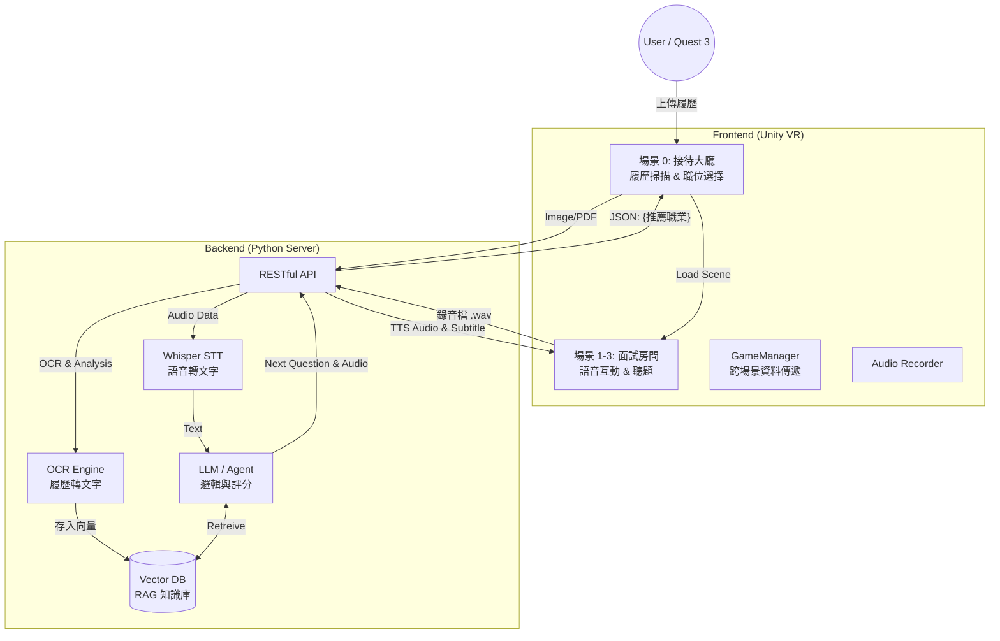
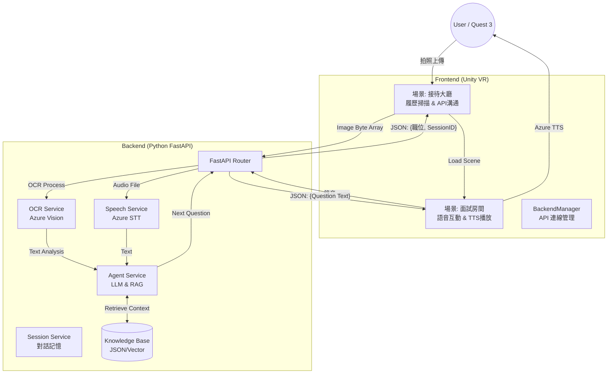

# VR RAG Interview Bot (沉浸式 AI 面試模擬系統)

<<<<<<< HEAD


> 結合 **VR 虛擬實境**、**RAG (檢索增強生成)** 與 **OCR 文字辨識** 技術，為求職者提供高度客製化、沉浸式的面試演練體驗。

## 📖 專案簡介 (Introduction)

本專案旨在解決傳統面試練習缺乏臨場感與客製化回饋的問題。透過 Unity 建構 VR 場景，結合後端強大的 LLM (大型語言模型) 運算能力，系統能根據使用者上傳的「真實履歷」，自動生成對應職缺（前端、後端、PM 等）的面試題目。

系統採用 **Client-Server 架構**，前端專注於沉浸式體驗與互動，後端負責繁重的 AI 運算（語音轉文字 STT、語意分析、題目生成），以確保 Meta Quest 3 裝置能維持流暢的效能表現。

## 🌟 核心功能 (Key Features)

* **履歷分析 (Resume Analysis):**
    * 在 VR 中支援掃描/拍攝履歷。
    * 後端透過 OCR 辨識內容，並利用 LLM 自動推薦適合的面試職位。
* **RAG 動態問答 (Dynamic Questioning):**
    * 不同於傳統固定的題庫，系統將使用者的「履歷內容」與「職缺要求」存入向量資料庫 (Vector DB)。
    * 面試官 (AI) 會針對使用者的經歷進行追問（例如：「我看您履歷提到 Vue.js，請說明其生命週期...」）。
* **全語音互動 (Voice Interaction):**
    * **STT (Speech-to-Text):** 前端錄製音檔傳送至後端，透過 Whisper 等模型進行高精準度辨識（優化專有名詞與中英夾雜的辨識率）。
    * **TTS (Text-to-Speech):** AI 面試官具備語音合成能力，提供真實對話感。
* **沉浸式場景切換:** 根據選擇的職業（前端/後端/PM），動態切換至對應的面試房間與 3D 角色。

## 🏗️ 系統架構 (System Architecture)

本專案採用前後端分離設計，確保邏輯清晰與擴充性。



=======


> **結合 VR 虛擬實境、RAG (檢索增強生成) 與 Azure 語音技術，打造高度客製化的沉浸式面試演練體驗。**

## 📖 專案簡介 (Introduction)

本專案解決了傳統面試練習缺乏臨場感與即時回饋的痛點。透過 **Unity** 建構 VR 場景，結合 **Python FastAPI** 後端與 **LLM (大型語言模型)**，系統能根據使用者上傳的真實履歷，自動推斷職位並生成客製化面試題目。

系統採用 **Client-Server 架構**：
* **前端 (Unity/VR)**：負責沉浸式體驗、錄音、TTS 語音合成與場景互動。
* **後端 (Python)**：負責繁重的 AI 運算，包括 OCR 履歷辨識、STT 語音轉文字、RAG 檢索與 LLM 邏輯推理。

## ✨ 核心功能 (Key Features)

* **📄 智慧履歷分析**：
    * 支援 VR 中拍照/上傳履歷。
    * 後端整合 **Azure OCR** 與 **LLM**，自動提取技能關鍵字並推斷應徵職位。
* **🧠 RAG 動態問答**：
    * 拒絕死板題庫！系統將面試知識庫向量化 (Vector DB)。
    * AI 根據「履歷內容」與「歷史對話」動態生成追問（e.g., "您提到熟悉 Unity，請說明 Coroutine 的運作原理..."）。
* **🗣️ 全語音互動 Loop**：
    * **STT (Azure)**：後端接收使用者的 `.wav` 錄音檔，精準轉換為文字。
    * **TTS (Azure)**：Unity 端接收文字後，即時合成自然語音，模擬真實面試官口吻。
* **🎭 沉浸式場景切換**：
    * 根據分析出的職位（後端工程師、飯店櫃檯、營養師...），Unity 自動切換至對應的 3D 面試場景。

## 🏗️ 系統架構 (System Architecture)



## 📂 專案結構 (Project Structure)

後端採用 Clean Architecture 設計，職責分明：
```
vr-interview-system/
├── backend/                  # 後端核心程式碼
│   ├── api/                  # API 路由層 (接口)
│   │   ├── resume_router.py  # 處理履歷上傳
│   │   └── interview_router.py # 處理面試對話 (STT+LLM)
│   ├── services/             # 業務邏輯層 (核心)
│   │   ├── ocr_service.py    # 視覺辨識 (Azure)
│   │   ├── speech_service.py # 語音轉文字 (Azure STT)
│   │   ├── agent_service.py  # LLM 思考與 RAG 檢索
│   │   ├── rag_service.py    # 向量資料庫操作
│   │   └── session_service.py # 使用者狀態管理
│   │   └── resume_service.py
│   ├── models/               # Pydantic 資料模型
│   │   └── pydanic_models.py
│   ├── config.py             # 環境變數與路徑設定
│   └── main.py               # FastAPI 啟動入口
│
├── scripts/                  # 工具腳本 (生成題庫、測試用)
├── knowledge_base/           # RAG 用的面試題庫 (JSON)
├── uploads/                  # 暫存上傳的履歷
├── static/audio/             # 暫存語音檔案
├── run.py                    # 伺服器一鍵啟動腳本
├── .env                      # API 金鑰設定檔 (由 .env.example 複製)
└── README.md
```

## 🚀 快速啟動 (Quick Start)

### 1. 前置準備 (Prerequisites)
* **Ollama 服務：** 本專案需要 Ollama 作為後端 LLM 服務器。請確保您已安裝並運行 Ollama 服務。
* **Meta Quest 3 裝置：** (用於沉浸式體驗)。
* **Python 3.10 環境。**
* **Unity 專案環境：** 安裝與專案版本相符的 Unity Editor。

### 2. 後端環境架設
1.  **安裝依賴：**

    ```bash
    # 在專案根目錄執行
    uv sync
    # 若需手動安裝核心套件:
    # uv add fastapi uvicorn python-multipart azure-cognitiveservices-speech azure-cognitiveservices-vision-computervision msrest pydantic-settings
    ```

    > **提示：** 如果缺少任何 Python 模組，請使用 `uv add <module_name>` 安裝。

2.  **配置 LLM 模型：** 確保您已透過 Ollama 下載所需模型，例如 llama3.1:8b：

    ```bash
    # 在新的終端機中執行
    ollama pull llama3.1:8b
    ```

3.  **環境變數配置 (`.env`)：**

    在 `src/` 目錄內創建 `.env` 檔案，用於儲存 API Key 或其他配置。

    ```ini
    # .env
    AZURE_SUBSCRIPTION_KEY=你的_Vision_Key
    AZURE_ENDPOINT=你的_Vision_Endpoint
    AZURE_SPEECH_KEY=你的_Speech_Key
    AZURE_SPEECH_REGION=southeastasia
    ```

4.  **生成知識庫 (若為初次執行)：**

    ```bash
    uv run scripts/batch_knowledge_generator.py
    ```

5.  **啟動伺服器：**

    ```bash
    uv run run.py
    ```
* 伺服器將啟動於: http://0.0.0.0:8000
* API 文件 (Swagger UI): http://localhost:8000/docs

### 3. Unity 前端設定

1. 開啟 Unity 專案。
2. 找到 Assets/Scripts/BackendManager.cs。
3. 修改 baseUrl 為您電腦的 區域網路 IP (例如 192.168.1.100)：

    ```C#
    private string baseUrl = "[http://192.168.1.100:8000/api/v1](http://192.168.1.100:8000/api/v1)";
    ```

4. 在 Assets/Scripts/QuestionReaderWithTTS.cs 中填入 Azure Speech Key (用於 TTS)。
5. Build 並部署至 Meta Quest 3，或在 Editor 中測試。

##　🧪 測試與驗證

* API 測試: 啟動伺服器後，進入 Swagger UI (/docs)，可直接測試 /upload 與 /answer 接口。
* 服務測試: 執行 uv run scripts/manual_test_services.py 可單獨測試 OCR、STT 與 LLM 邏輯是否正常。

---

### 👨‍💻 開發團隊 (Development Team)

> **沉浸式智慧模擬面試訓練平台 (2025)**

本專案由以下成員共同開發維護：

| 成員 (Member) | 負責領域 (Role) | GitHub |
| :--- | :--- | :--- |
| **[* 張芯綾]** | Backend 開發 & 專案管理 & 測試 | [](https://github.com/cHiwAAWa) |
| **[林芝瑩]** | Unity VR 開發 & TTS 開發| [](https://github.com/zhiying122) |
| **[陳晶晶]** | Backend 開發 & 架構| [](https://github.com/taiyou100001) |
| **[林鼎貴]** | OCR 開發 | [](https://github.com/Lcd0327) |
| **[林威廷]** | RAG 開發 | [](https://github.com/Lin910105) |

---
>>>>>>> origin/Vivi
